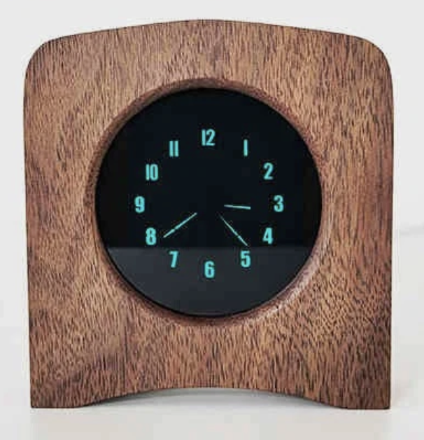

# acornvfd

[](https://github.com/katbyte/acorn-vfd/releases/latest)
[](https://github.com/katbyte/acorn-vfd/blob/main/go.mod)
[](https://github.com/katbyte/acorn-vfd/blob/main/LICENSE)


<p align="center">
  
</p>

**Control the 橡果工坊 (Acorn Workshop) IV48 / 1V48 round-dial VFD fluorescent clock over Bluetooth from the
command line, on macOS, Linux, or Windows, without the WeChat mini-program.**

`acornvfd` is a small cross-platform CLI for the **1V48 荧光屏指针时钟** (1V48 VFD analog-pointer / round-dial
fluorescent clock, [product page and manual](https://diym.vip/archives/1.shi-yong-shuo-ming-fen-xiang),
maker site [diym.vip](https://diym.vip)). Set the time, sync from your computer, change brightness, alarms
and the display options that the phone app exposes, all from a script or terminal. It also carries
decoded-but-untested commands for the maker's other "XGGF" BLE devices (the spectrum lamps).

**The Bluetooth protocol is undocumented.** It was reverse-engineered from the vendor's own control app, the
WeChat mini-program **橡果易控** and the matching Android build (`XGGF.apk` from diym.vip, a uni-app/DCloud
bundle). [PROTOCOL.md](PROTOCOL.md) documents every BLE packet, the GATT service and characteristic UUIDs,
the 8-byte command frame and its checksum, and marks what is verified in the app source, verified live on the
clock, or still a guess, so you can build your own client in any language.

If you searched for how to set the time on this clock without WeChat, how to talk to it over BLE, or what its
protocol is, this is that. See [keywords](#keywords) for the many names this clock goes by.

```
$ acornvfd scan
scanning for 15s...
1A2B3C4D-...  rssi  -61  XGGF-1V48

$ acornvfd time              # set date + time from this computer
set date 2026-09-07          FF 01 00 1A 09 07 00 D6
set time 16:51:04            FF 01 01 10 33 04 00 B8
ok sent 2 packets

$ acornvfd time 07:30        # set just the time
$ acornvfd brightness 5
$ acornvfd alarm 06:45 && acornvfd alarm on
```

## Compatibility

This targets 橡果工坊's **XGGF-1V48** fluorescent clock specifically. The 8-byte command set is
product-specific even within the maker's own range: the spectrum lamps (XGGF-XW25/8W25/8W30-PRO) use a
different command group (handled by `lamp`, untested), and the maker's nixie/glow clocks (XGGF-IN12xx/IN14xx)
speak an unrelated ASCII protocol this tool does not implement.

Clocks from other makers are unlikely to work: the framing, the `0xFF` header, the subtractive checksum and
the command groups are all this vendor's own, not a standard. The transport underneath (Nordic UART Service,
`6e400001-…`) is generic, so if some other device happened to run the identical firmware, e.g. a rebrand of
the same board, you could point acornvfd at it with `--name` or `--address` and the clock commands might
land. No such compatible non-Acorn device is known or tested; treat anything that is not an XGGF-1V48 as
unsupported, and use `dump` plus `raw` to probe at your own risk.

## Install

Homebrew (macOS and Linux):

```
brew install katbyte/tap/acornvfd
```

Binaries for macOS, Linux and Windows are also on the releases page. From source (Go 1.27+; macOS needs the
Xcode command line tools because CoreBluetooth is reached through cgo):

```
go install github.com/katbyte/acornvfd@latest
```

or clone and `make build`.

**macOS**: the terminal app you run this from needs Bluetooth permission
(System Settings → Privacy & Security → Bluetooth). The first run prompts for it; if it was denied, `scan`
fails with an adapter error until you allow it there.

**Linux**: uses BlueZ over D-Bus; your user needs to be allowed to talk to `org.bluez` (the default on
desktop distributions).

## Commands

| Command | What it does |
|---|---|
| `scan [--all]` | list nearby XGGF devices (all BLE devices with `--all`) |
| `dump` | connect and print every GATT service/characteristic, to compare against PROTOCOL.md |
| `listen [--duration 30s]` | subscribe to the notify characteristic and print anything the device sends |
| `time [HH:MM[:SS]]` | no argument syncs date and time from this computer (`--date-only` / `--time-only`); an argument sets just the time |
| `date [YYYY-MM-DD]` | no argument sets today's date; an argument sets that date |
| `brightness <0-7\|N%\|auto\|manual>` | manual level (the app's slider maps 0-100 % onto 0-7) or auto-brightness on/off |
| `alarm <HH:MM\|on\|off>` | alarm time, or enable/disable |
| `display analog\|digital` | display mode (显示模式) |
| `tick on\|off` | per-second tick sound (秒钟提示音) |
| `transition on\|off` | hourly transition animation (小时过渡动画) |
| `auto-sync on\|off` | the clock's 自动校时 toggle (what the firmware does with it is unknown) |
| `raw <hex...> [--no-checksum]` | send an arbitrary packet; 7 bytes get the checksum appended |
| `lamp power\|mode\|colour ...` | spectrum lamp commands (XGGF-XW25/8W25/8W30-PRO), decoded but **untested** |
| `version` | print the version |

Every command that talks to the device accepts `--dry-run`, which prints the packets and touches nothing.

### The clock cannot be read back

The protocol is write-only, confirmed on the real clock: its notify characteristic emits only a one-byte
heartbeat (`0x23`, `#`) about every 3 seconds and never reports its settings, and the vendor app never even
subscribes. There is no command that reads a value back, so acornvfd only sets; there is no `get`. Use
`listen` if you want to watch the heartbeat.

### Finding the clock (why `--address` matters)

The clock advertises its name `XGGF-1V48` only intermittently; most of its advertisements carry no name at
all, so name matching alone often fails to find it. Its address, however, is in every advertisement. First
run, capture the address once:

```
acornvfd scan --all        # find the line whose name is XGGF-1V48, copy its address
acornvfd time --address <that-address>
```

After one successful connection acornvfd remembers the address and reuses it automatically, so later
commands need no flags. Note the clock tends to stop advertising for a while right after a disconnect, so a
second connection may need a short wait or a power-cycle.

## Flags, env vars and config file

Every persistent flag can also come from an environment variable or a `.acornvfd` file (env format,
`KEY=value`) in your home directory or the current directory:

| Flag | Env | Default |
|---|---|---|
| `--name` / `-n` | `ACORNVFD_NAME` | `XGGF-1V48` (prefix match on the advertised name) |
| `--address` / `-a` | `ACORNVFD_ADDRESS` | (none) exact address from `scan`; overrides `--name` |
| `--scan-timeout` | `ACORNVFD_SCAN_TIMEOUT` | `15s` |
| `--gap` | `ACORNVFD_GAP` | `100ms` between packets |
| `--no-response` | `ACORNVFD_NO_RESPONSE` | off (write-with-response, like the app) |
| `--service` / `--write-char` / `--notify-char` | `ACORNVFD_SERVICE` / `..._WRITE_CHAR` / `..._NOTIFY_CHAR` | auto-detect the Nordic UART service |
| `--state-file` | `ACORNVFD_STATE_FILE` | `<user config dir>/acornvfd/device.json` (remembered clock address) |
| `--quiet` / `-q`, `--silent`, `--verbose` / `-v`, `--uncoloured` / `-u` | `ACORNVFD_QUIET`, `ACORNVFD_SILENT`, (flag only), `ACORNVFD_UNCOLOURED` | |

`ACORNVFD_LOG=debug` turns on the internal logger.

On macOS the address is a CoreBluetooth UUID that is stable for that Mac but differs from the device's MAC;
`scan` prints whatever form your platform uses and `--address` accepts it back.

## Verifying against a real clock

1. `acornvfd scan` – confirm the clock advertises as `XGGF-1V48` and note the address.
2. `acornvfd dump` – confirm the Nordic UART service `6e400001-…` with `6e400002` (write) and
   `6e400003` (notify) is present. If the UUIDs differ, pass `--service`/`--write-char`.
3. `acornvfd time --dry-run` then `acornvfd time` – the clock should jump to your computer's time.
4. `acornvfd brightness 1` then `7` – visible change confirms the checksum and framing.
5. `acornvfd listen` shows the clock's `#` heartbeat; it never reports its settings.

If nothing works, capture an HCI snoop log from an Android phone running the WeChat mini-program
(Developer options → Enable Bluetooth HCI snoop log, reproduce, `adb bugreport`, open
`btsnoop_hci.log` in Wireshark, filter `btatt.opcode == 0x12`) and compare the writes with PROTOCOL.md.

## Development

```
make build      # go build with version info (needs cgo on macOS)
make test       # unit tests, no Bluetooth needed
make lint       # golangci-lint from the pin in .tools/go.mod
make check-all  # build + test + all linters + depscheck
```

Packet builders live in `lib/xggf` (pure, fully unit-tested), the Bluetooth layer in `lib/ble`, the
commands in `cli`. Adding a command is a new `cobra.Command` that builds a packet with `lib/xggf` and
hands it to `sendPackets`.

## Keywords

Names and search terms for this clock and project, so people looking for it can find it:

橡果工坊, Acorn Workshop, XGGF, XGGF-1V48, 1V48, IV48, IV-48, 荧光钟, 荧光管时钟, 荧光屏指针时钟, 荧光圆盘时钟,
round-dial VFD clock, fluorescent display clock, VFD tube clock, analog pointer VFD clock, diym.vip.

橡果易控 (the vendor's WeChat mini-program / 微信小程序), 橡果易控 App, WeChat mini program clock control,
control XGGF clock without WeChat, set time on 荧光钟 from computer.

Bluetooth LE / BLE clock control, Nordic UART Service (NUS) `6e400001` clock, GATT reverse engineering,
BLE protocol reverse engineering, XGGF.apk decompile, uni-app / DCloud app reverse engineering, HCI snoop
log clock, bleak alternative in Go, tinygo bluetooth CLI, cross-platform BLE clock tool, sync VFD clock time
from macOS / Linux / Windows.
